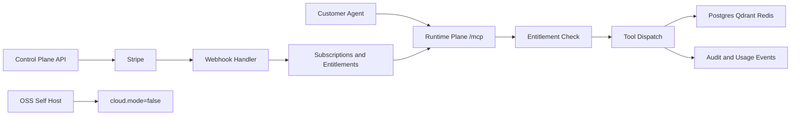

# Private Cloud Subscription Control Plane Implementation Plan

## Overview

Build a paid managed cloud offering for Nerve MCP while preserving the existing open-source self-host path. The cloud offering adds subscription billing, tenant-scoped auth, plan entitlements, rate limits, and usage metering so teams can pay for a simple, robust hosted setup.

This plan formalizes a two-plane architecture:

- Runtime Plane (data plane): MCP execution, tool dispatch, audit, usage capture.
- Control Plane: org lifecycle, billing lifecycle, credential issuance, entitlement sync.



## Current State Analysis

The current architecture is a strong OSS runtime but not yet a monetizable cloud product:

- Self-host flow is complete (`make up`, `make seed`, `make mcp-test`) in `/Users/dmitrymolchanov/Programs/Nerve/README.md:5` and `/Users/dmitrymolchanov/Programs/Nerve/docs/QUICKSTART.md:3`.
- MCP server and tool dispatch are centralized in `/Users/dmitrymolchanov/Programs/Nerve/internal/mcp/server.go:32` and `/Users/dmitrymolchanov/Programs/Nerve/internal/mcp/server.go:76`.
- Non-dev MCP auth is static `X-API-Key` or origin allowlist in `/Users/dmitrymolchanov/Programs/Nerve/internal/mcp/server.go:282`.
- Multi-tenant primitives exist (`orgs`, `api_keys`, `inboxes.org_id`) in `/Users/dmitrymolchanov/Programs/Nerve/internal/store/migrations/0001_init.sql:4`.
- `threads` and `messages` currently rely on `inbox_id` linkage and do not carry `org_id` directly in `/Users/dmitrymolchanov/Programs/Nerve/internal/store/migrations/0001_init.sql:33` and `/Users/dmitrymolchanov/Programs/Nerve/internal/store/migrations/0001_init.sql:46`.
- Product docs already expect cloud auth and deliverability control (`OAuth-scoped MCP auth`, deliverability gating) in `/Users/dmitrymolchanov/Programs/Nerve/docs/NeuralMail_PRD.md:79`.

## Desired End State

Nerve ships in two aligned modes from the same repository:

1. OSS self-host mode (free): current local runtime remains available and unchanged.
2. Managed cloud mode (paid): authenticated tenant access to hosted MCP with subscription-backed entitlements.

After implementation:

- Each org has deterministic subscription and entitlement state in local DB.
- Cloud MCP requests are authenticated on every HTTP request and resolved to a principal (`org_id`, `actor`, `scopes`, `token_id`).
- Tool execution is gated by atomic quota reserve and per-org rate limits.
- Usage and billing events are idempotent, auditable, and reconcilable.
- Stripe outages do not block runtime MCP auth/entitlement decisions.
- OSS local workflows continue to pass without cloud dependencies.

### Key Discoveries

- Cloud gating should be inserted at MCP dispatch boundary (`/Users/dmitrymolchanov/Programs/Nerve/internal/mcp/server.go:76`).
- Audit plumbing already exists (`RecordToolCall`, `RecordAudit`) and is suitable for usage correlation (`/Users/dmitrymolchanov/Programs/Nerve/internal/store/store.go:239`).
- Query patterns are currently `thread_id` and `inbox_id` based (`/Users/dmitrymolchanov/Programs/Nerve/internal/store/store.go:122`), so tenant hardening must include schema and store changes.
- Deployment assets currently target local runtime only (`/Users/dmitrymolchanov/Programs/Nerve/deploy/docker/cortex/Dockerfile`).

## Assumptions Locked For This Plan

- Billing provider: Stripe Billing for subscriptions and customer portal.
- Auth strategy in cloud mode: dual path.
  - OIDC/JWT Bearer for user-facing and control-plane flows.
  - Scoped cloud API keys for agent/server-to-server flows.
- Token-to-org mapping: `org_id` is a required claim for Nerve-issued service JWT; cloud API keys resolve `org_id` from DB.
- Commercial model in MVP: monthly subscription plans with included usage units and rate tiers.
- Billing settlement in MVP: flat subscription billing only; usage is enforced internally and not pushed to Stripe as billable meter events yet.
- Entitlement checks are local-state only (no Stripe calls in MCP request path).

## What We're NOT Doing

- Dedicated per-customer VPC/private networking in MVP.
- Full custom OAuth authorization server implementation.
- Complex enterprise invoicing workflows (PO/net terms/ERP sync).
- License-gating or degrading OSS self-host capabilities.

## Implementation Approach

Introduce cloud controls around the existing runtime without forking core MCP/tool code.

### Design Invariants

- Runtime Plane never calls Stripe synchronously during MCP request handling.
- Cloud auth is evaluated on every request to `/mcp` in cloud mode.
- Entitlements are read from local snapshot tables; Stripe drives async updates only.
- Quota enforcement uses atomic reserve semantics to avoid overshoot under concurrency.
- Tenant isolation uses both app-layer checks and DB-level controls.
- `cloud.mode=false` remains default and preserves existing OSS behavior.

## Phase 1: Cloud Data Model, Indexing, And Meter Foundations

### Overview

Add cloud schema primitives with strong constraints and scale-ready indexes, plus denormalized entitlement snapshots and usage meters.

### Changes Required

#### 1. New migration for cloud control-plane primitives
**File**: `/Users/dmitrymolchanov/Programs/Nerve/internal/store/migrations/0002_cloud_control_plane.sql`  
**Changes**: Add plan, subscription, entitlement, usage, webhook dedupe, and cloud key tables.

```sql
CREATE TABLE plan_entitlements (
  id uuid PRIMARY KEY DEFAULT gen_random_uuid(),
  plan_code text NOT NULL UNIQUE,
  mcp_rpm int NOT NULL,
  monthly_units bigint NOT NULL,
  max_inboxes int NOT NULL,
  features jsonb NOT NULL DEFAULT '{}',
  created_at timestamptz NOT NULL DEFAULT now()
);

CREATE TABLE subscriptions (
  id uuid PRIMARY KEY DEFAULT gen_random_uuid(),
  org_id uuid NOT NULL REFERENCES orgs(id) ON DELETE CASCADE,
  provider text NOT NULL,
  external_customer_id text NOT NULL,
  external_subscription_id text NOT NULL,
  status text NOT NULL,
  current_period_start timestamptz,
  current_period_end timestamptz,
  cancel_at_period_end boolean NOT NULL DEFAULT false,
  created_at timestamptz NOT NULL DEFAULT now(),
  updated_at timestamptz NOT NULL DEFAULT now(),
  UNIQUE(org_id),
  UNIQUE(external_subscription_id)
);

CREATE TABLE org_entitlements (
  org_id uuid PRIMARY KEY REFERENCES orgs(id) ON DELETE CASCADE,
  plan_code text NOT NULL,
  subscription_status text NOT NULL,
  mcp_rpm int NOT NULL,
  monthly_units bigint NOT NULL,
  max_inboxes int NOT NULL,
  usage_period_start timestamptz NOT NULL,
  usage_period_end timestamptz NOT NULL,
  grace_until timestamptz,
  updated_at timestamptz NOT NULL DEFAULT now()
);

CREATE TABLE org_usage_counters (
  id uuid PRIMARY KEY DEFAULT gen_random_uuid(),
  org_id uuid NOT NULL REFERENCES orgs(id) ON DELETE CASCADE,
  meter_name text NOT NULL,
  period_start timestamptz NOT NULL,
  period_end timestamptz NOT NULL,
  used bigint NOT NULL DEFAULT 0,
  updated_at timestamptz NOT NULL DEFAULT now(),
  UNIQUE(org_id, meter_name, period_start)
);

CREATE TABLE usage_events (
  id uuid PRIMARY KEY DEFAULT gen_random_uuid(),
  org_id uuid NOT NULL REFERENCES orgs(id) ON DELETE CASCADE,
  meter_name text NOT NULL,
  quantity int NOT NULL DEFAULT 1,
  tool_name text NOT NULL,
  replay_id text,
  audit_id uuid,
  status text NOT NULL,
  created_at timestamptz NOT NULL DEFAULT now()
);

CREATE TABLE webhook_events (
  id uuid PRIMARY KEY DEFAULT gen_random_uuid(),
  provider text NOT NULL,
  external_event_id text NOT NULL,
  event_type text NOT NULL,
  payload_hash text,
  processed_at timestamptz NOT NULL DEFAULT now(),
  status text NOT NULL,
  error_message text,
  UNIQUE(provider, external_event_id)
);

CREATE TABLE cloud_api_keys (
  id uuid PRIMARY KEY DEFAULT gen_random_uuid(),
  org_id uuid NOT NULL REFERENCES orgs(id) ON DELETE CASCADE,
  key_prefix text NOT NULL,
  key_hash text NOT NULL,
  label text,
  scopes text[] NOT NULL DEFAULT '{}',
  revoked_at timestamptz,
  created_at timestamptz NOT NULL DEFAULT now(),
  UNIQUE(key_hash)
);
```

#### 2. Indexes and idempotency constraints
**File**: `/Users/dmitrymolchanov/Programs/Nerve/internal/store/migrations/0002_cloud_control_plane.sql`  
**Changes**: Add high-frequency query indexes.

```sql
CREATE INDEX idx_subscriptions_org ON subscriptions(org_id);
CREATE INDEX idx_subscriptions_status ON subscriptions(status);
CREATE INDEX idx_usage_events_org_created ON usage_events(org_id, created_at);
CREATE UNIQUE INDEX idx_usage_events_replay ON usage_events(replay_id) WHERE replay_id IS NOT NULL;
CREATE INDEX idx_org_usage_meter_period ON org_usage_counters(org_id, meter_name, period_start);
```

#### 3. Tenant hardening columns
**File**: `/Users/dmitrymolchanov/Programs/Nerve/internal/store/migrations/0002_cloud_control_plane.sql`  
**Changes**: Add and backfill `org_id` on tenant data tables to simplify secure filtering and RLS.

```sql
ALTER TABLE threads ADD COLUMN org_id uuid;
UPDATE threads t SET org_id = i.org_id FROM inboxes i WHERE t.inbox_id = i.id;
ALTER TABLE threads ALTER COLUMN org_id SET NOT NULL;

ALTER TABLE messages ADD COLUMN org_id uuid;
UPDATE messages m SET org_id = i.org_id FROM inboxes i WHERE m.inbox_id = i.id;
ALTER TABLE messages ALTER COLUMN org_id SET NOT NULL;

CREATE INDEX idx_threads_org ON threads(org_id);
CREATE INDEX idx_messages_org ON messages(org_id);
```

#### 4. Cloud config expansion
**File**: `/Users/dmitrymolchanov/Programs/Nerve/internal/config/config.go`  
**Changes**: Add config sections and env overrides for cloud/auth/billing/metering.

```go
Cloud struct {
    Mode bool `yaml:"mode"`
    PublicBaseURL string `yaml:"public_base_url"`
}
Auth struct {
    Issuer string `yaml:"issuer"`
    Audience string `yaml:"audience"`
    JWKSURL string `yaml:"jwks_url"`
}
Billing struct {
    Provider string `yaml:"provider"`
    StripeSecretKey string `yaml:"stripe_secret_key"`
    StripeWebhookSecret string `yaml:"stripe_webhook_secret"`
}
Metering struct {
    ToolCostPath string `yaml:"tool_cost_path"`
    PastDueGraceDays int `yaml:"past_due_grace_days"`
}
```

#### 5. Tool cost map configuration
**File**: `/Users/dmitrymolchanov/Programs/Nerve/configs/meters/tool_costs.yaml`  
**Changes**: Introduce unit-cost abstraction (default values can all be `1` initially).

### Success Criteria

#### Automated Verification
- [x] Migration applies cleanly from empty DB and from existing schema state.
- [x] Unique/partial index behavior validated by store tests.
- [x] Config tests for new env overrides pass: `go test ./internal/config/...`.
- [x] Existing test suite still passes: `go test ./...`.

#### Manual Verification
- [ ] Existing local OSS flow unchanged: `make up && make mcp-test`.
- [ ] New cloud tables and indexes exist and support expected query paths.
- [ ] Backfilled `org_id` values in `threads` and `messages` are complete.

**Implementation Note**: After completing this phase and all automated verification passes, pause for manual confirmation before Phase 2.

---

## Phase 2: Cloud Auth, Principal Resolution, And Tenant Isolation

### Overview

Implement per-request cloud authentication and defense-in-depth tenant isolation in both application and database layers.

### Changes Required

#### 1. Principal model and request authentication
**File**: `/Users/dmitrymolchanov/Programs/Nerve/internal/auth/context.go`  
**Changes**: Define principal without plan authority in token.

```go
type Principal struct {
    OrgID string
    ActorID string
    TokenID string
    Scopes []string
    AuthMethod string // jwt or cloud_api_key
}
```

**File**: `/Users/dmitrymolchanov/Programs/Nerve/internal/auth/verifier.go`  
**Changes**: Support both JWT bearer and cloud API key auth.

```go
func (s *Service) AuthenticateRequest(r *http.Request) (Principal, error) {
    if strings.HasPrefix(r.Header.Get("Authorization"), "Bearer ") {
        return s.VerifyJWT(r.Header.Get("Authorization"))
    }
    if key := r.Header.Get("X-Nerve-Cloud-Key"); key != "" {
        return s.VerifyCloudAPIKey(key)
    }
    return Principal{}, ErrUnauthorized
}
```

#### 2. Explicit token-to-org mapping rules
**File**: `/Users/dmitrymolchanov/Programs/Nerve/docs/SECURITY.md`  
**Changes**:
- Service JWTs must include `org_id`, `scope`, `sub`, and `jti`.
- JWTs without `org_id` are rejected in cloud runtime.
- Control plane token issuance endpoint is the authority for service-token claims.

#### 3. MCP runtime auth behavior in cloud mode
**File**: `/Users/dmitrymolchanov/Programs/Nerve/internal/mcp/server.go`  
**Changes**:
- Authenticate every request to `/mcp` in cloud mode before session/method dispatch.
- Return HTTP 401 for invalid/expired credentials.
- Return HTTP 403 for insufficient scopes.
- Continue JSON-RPC responses for tool-level business errors.

#### 4. Scope enforcement model
**File**: `/Users/dmitrymolchanov/Programs/Nerve/internal/mcp/server.go`  
**Changes**: Map methods/tools to scope families:
- `nerve:email.read`
- `nerve:email.search`
- `nerve:email.draft`
- `nerve:email.send`
- `nerve:admin.billing` (control-plane only)

#### 5. Database-level tenant isolation (RLS)
**File**: `/Users/dmitrymolchanov/Programs/Nerve/internal/store/migrations/0003_tenant_rls.sql`  
**Changes**: Enable RLS on tenant tables using `org_id`.

```sql
ALTER TABLE inboxes ENABLE ROW LEVEL SECURITY;
ALTER TABLE threads ENABLE ROW LEVEL SECURITY;
ALTER TABLE messages ENABLE ROW LEVEL SECURITY;

CREATE POLICY tenant_isolation_inboxes ON inboxes
  USING (org_id = current_setting('app.current_org_id')::uuid);
CREATE POLICY tenant_isolation_threads ON threads
  USING (org_id = current_setting('app.current_org_id')::uuid);
CREATE POLICY tenant_isolation_messages ON messages
  USING (org_id = current_setting('app.current_org_id')::uuid);
```

**File**: `/Users/dmitrymolchanov/Programs/Nerve/internal/store/store.go`  
**Changes**: Set `SET LOCAL app.current_org_id = $1` in cloud-mode transaction/session wrappers.

#### 6. App-layer ownership checks remain mandatory
**File**: `/Users/dmitrymolchanov/Programs/Nerve/internal/tools/service.go`  
**Changes**: Keep explicit ownership checks (`EnsureInboxBelongsToOrg`, `EnsureThreadBelongsToOrg`, `EnsureMessageBelongsToOrg`) for clear error semantics.

### Success Criteria

#### Automated Verification
- [x] JWT and cloud API key verifier tests pass.
- [x] Scope checks produce 401/403 correctly in HTTP tests.
- [x] RLS tests prove cross-org reads return zero rows even if app filters are omitted.
- [x] Existing OSS auth path still passes: `make mcp-test` with `cloud.mode=false`.

#### Manual Verification
- [ ] Cloud request without credentials is rejected with 401.
- [ ] Insufficient scope returns 403.
- [ ] Org A credential cannot access Org B inbox/thread/message.
- [ ] OSS local mode behavior remains unchanged.

**Implementation Note**: After completing this phase and all automated verification passes, pause for manual confirmation before Phase 3.

---

## Phase 3: Entitlement Enforcement, Quota Correctness, And Metering

### Overview

Enforce subscription status, quota, and rate limits with atomic correctness and explicit error contracts.

### Changes Required

#### 1. Entitlement status policy matrix
**File**: `/Users/dmitrymolchanov/Programs/Nerve/internal/entitlements/policy.go`  
**Changes**: Implement deterministic status behavior:

| Subscription Status | MCP Access | Behavior |
| --- | --- | --- |
| `trialing` | Yes | Full access within limits |
| `active` | Yes | Full access within limits |
| `past_due` | Yes until `grace_until` | Grace-period access, then block |
| `canceled` | No after period end | Block |
| `unpaid` | No | Immediate block |

#### 2. Atomic quota reserve
**File**: `/Users/dmitrymolchanov/Programs/Nerve/internal/entitlements/service.go`  
**Changes**: Replace check-then-increment with atomic reserve transaction.

```sql
UPDATE org_usage_counters
SET used = used + $cost, updated_at = now()
WHERE org_id = $org_id
  AND meter_name = 'mcp_units'
  AND period_start = $period_start
  AND used + $cost <= $monthly_units;
```

If zero rows affected, return quota error.

#### 3. Lazy usage-period rollover
**File**: `/Users/dmitrymolchanov/Programs/Nerve/internal/entitlements/service.go`  
**Changes**: In `CanExecute`, if `now() > usage_period_end`, rotate period bounds and reset/create counter before reserve.

#### 4. Rate limiting strategy
**File**: `/Users/dmitrymolchanov/Programs/Nerve/internal/entitlements/rate_limiter.go`  
**Changes**:
- MVP: per-instance per-org token bucket keyed by `org_id`, configured from `org_entitlements.mcp_rpm`.
- Return stable rate-limit error with retry hint.
- Document non-distributed behavior in MVP; distributed Redis variant planned in Phase 5.

#### 5. Usage record placement and semantics
**File**: `/Users/dmitrymolchanov/Programs/Nerve/internal/mcp/server.go`  
**Changes**: Middleware order:
- auth -> scope -> status -> rate -> atomic reserve -> tool execute -> usage event write.

Metering policy in MVP:
- Count successful tool executions.
- Do not count auth/rate-limit blocks.
- Persist failure status for executed tool failures in `usage_events` for reconciliation.

#### 6. Quota/rate error contract
**File**: `/Users/dmitrymolchanov/Programs/Nerve/internal/mcp/server.go`  
**Changes**: Add explicit JSON-RPC error codes and structured `data`:
- `-32040` `quota_exceeded`
- `-32041` `subscription_inactive`
- `-32042` `rate_limited` (include `retry_after_seconds`)

#### 7. `max_inboxes` enforcement
**File**: `/Users/dmitrymolchanov/Programs/Nerve/internal/cloudapi/handler.go`  
**Changes**: Enforce inbox-cap at org onboarding/inbox provisioning endpoints.

#### 8. Observability for entitlement decisions
**File**: `/Users/dmitrymolchanov/Programs/Nerve/internal/observability/entitlements.go`  
**Changes**:
- Structured logs for allow/deny with reason and org_id.
- Metrics for quota utilization and deny reasons.
- Warning threshold events at 80% quota utilization for proactive outreach.
- Alert hooks for repeated quota and rate-limit spikes.

### Success Criteria

#### Automated Verification
- [x] Concurrency test proves no quota overshoot under 100 parallel calls.
- [x] Rollover tests validate period boundary behavior.
- [x] Status policy tests cover all Stripe-aligned states.
- [x] Error contract tests validate JSON-RPC codes and payloads.

#### Manual Verification
- [ ] Active org can execute tools and usage increments correctly.
- [ ] Over-quota org receives deterministic non-retriable quota error.
- [ ] `past_due` org works during grace and blocks after grace.
- [ ] Entitlement logs and metrics clearly explain allow/deny outcomes.

**Implementation Note**: After completing this phase and all automated verification passes, pause for manual confirmation before Phase 4A.

---

## Phase 4A: Stripe Webhook Adapter And Entitlement Sync

### Overview

Implement webhook-first billing lifecycle sync with strict idempotency and local-state reconciliation.

### Changes Required

#### 1. Stripe adapter and webhook handler
**File**: `/Users/dmitrymolchanov/Programs/Nerve/internal/billing/stripe.go`  
**Changes**:
- Verify webhook signatures.
- Handle core events:
  - `checkout.session.completed`
  - `customer.subscription.created`
  - `customer.subscription.updated`
  - `customer.subscription.deleted`
  - `invoice.paid`
  - `invoice.payment_failed`
- Persist to `webhook_events` and skip duplicates by `(provider, external_event_id)`.

#### 2. Deterministic org resolution from Stripe events
**File**: `/Users/dmitrymolchanov/Programs/Nerve/internal/billing/stripe.go`  
**Changes**: Use `client_reference_id = org_id` in checkout session creation to avoid email-based matching.

#### 3. Entitlement sync writer
**File**: `/Users/dmitrymolchanov/Programs/Nerve/internal/store/store.go`  
**Changes**: Upsert `subscriptions` and `org_entitlements` from webhook status changes, including `grace_until` handling for `past_due`.

#### 4. Billing outage handling
**File**: `/Users/dmitrymolchanov/Programs/Nerve/docs/CLOUD_QUICKSTART.md`  
**Changes**: Document retry behavior and incident handling when webhook processing is delayed or Stripe is unavailable.

#### 5. Stripe usage-metering boundary for MVP
**File**: `/Users/dmitrymolchanov/Programs/Nerve/docs/PRICING_AND_ENTITLEMENTS.md`  
**Changes**: Explicitly document that MVP uses internal usage enforcement for limits while Stripe charges only the fixed subscription fee.

### Success Criteria

#### Automated Verification
- [x] Webhook replay tests show idempotent behavior.
- [x] Event-to-status mapping tests pass for all target Stripe states.
- [x] Failed webhook processing stores error status and supports reprocessing.

#### Manual Verification
- [ ] Stripe test event updates entitlement correctly.
- [ ] Duplicate webhook delivery does not duplicate side effects.
- [ ] Runtime continues serving based on local entitlements even if Stripe API is unavailable.

**Implementation Note**: After completing this phase and all automated verification passes, pause for manual confirmation before Phase 4B.

---

## Phase 4B: Control Plane API Surface And Credential Issuance

### Overview

Expose authenticated control-plane endpoints for org onboarding, checkout, token issuance, and billing self-service.

### Changes Required

#### 1. Control-plane service binary
**File**: `/Users/dmitrymolchanov/Programs/Nerve/cmd/nerve-control-plane/main.go`  
**Changes**: Add service entrypoint and router for control-plane APIs.

#### 2. Cloud API handlers
**File**: `/Users/dmitrymolchanov/Programs/Nerve/internal/cloudapi/handler.go`  
**Changes**: Implement:
- `POST /v1/orgs`
- `POST /v1/subscriptions/checkout`
- `POST /v1/billing/webhook/stripe`
- `GET /v1/subscriptions/current`
- `POST /v1/tokens/service`
- `POST /v1/billing/portal`

#### 3. Endpoint auth requirements
**File**: `/Users/dmitrymolchanov/Programs/Nerve/docs/SECURITY.md`  
**Changes**:
- Stripe webhook endpoint: Stripe signature verification only.
- Org creation/checkout: admin principal (`nerve:admin.billing`) or bootstrap admin API key.
- `POST /v1/tokens/service`: high-privilege endpoint; owner/admin only, short TTL, explicit scopes, full audit.

#### 4. Service token issuance policy
**File**: `/Users/dmitrymolchanov/Programs/Nerve/internal/cloudapi/tokens.go`  
**Changes**:
- Mint tokens scoped to org, scope set, and expiry.
- Support rotation and revocation semantics.
- Persist issuance metadata for audit.

### Success Criteria

#### Automated Verification
- [x] Control-plane auth tests enforce endpoint permission model.
- [x] Checkout handler tests include `client_reference_id` mapping.
- [x] Token issuance tests validate scope/TTL constraints.

#### Manual Verification
- [ ] Authorized owner can create org and initiate checkout.
- [ ] Unauthorized caller is denied for token issuance endpoint.
- [ ] Customer portal session endpoint returns valid Stripe portal URL.

**Implementation Note**: After completing this phase and all automated verification passes, pause for manual confirmation before Phase 5.

---

## Phase 5: Cloud Operations, Security Hardening, And Commercial Readiness

### Overview

Operationalize production cloud delivery, security posture, and lifecycle smoke tests for paid onboarding confidence.

### Changes Required

#### 1. Deployment assets
**File**: `/Users/dmitrymolchanov/Programs/Nerve/deploy/cloud/docker-compose.cloud.yml`  
**Changes**: Runtime and control-plane compose profile with cloud-mode settings.

**File**: `/Users/dmitrymolchanov/Programs/Nerve/deploy/cloud/env.example`  
**Changes**: Required cloud env vars and secret placeholders.

#### 2. Secrets management guidance
**File**: `/Users/dmitrymolchanov/Programs/Nerve/docs/CLOUD_SECURITY.md`  
**Changes**: Production secret handling requirements for:
- `stripe_secret_key`
- `stripe_webhook_secret`
- OIDC and signing keys

Document that production must use secrets manager (not plaintext env in deployment manifests).

#### 3. Cloud lifecycle smoke CI
**File**: `/Users/dmitrymolchanov/Programs/Nerve/.github/workflows/cloud-e2e-smoke.yml`  
**Changes**: Scheduled/manual workflow:
- start control-plane + runtime
- simulate webhook activation
- mint service token
- run MCP initialize + tool call
- assert usage counter increment
- simulate entitlement deactivation and assert blocked access

#### 4. Meter and entitlement reconciliation job
**File**: `/Users/dmitrymolchanov/Programs/Nerve/cmd/nerve-reconcile/main.go`  
**Changes**:
- Daily reconciliation between `usage_events` and `org_usage_counters`.
- Daily backstop rollover for orgs with no post-period traffic.

#### 5. MCP protocol compatibility logging
**File**: `/Users/dmitrymolchanov/Programs/Nerve/internal/mcp/server.go`  
**Changes**: Log/request-tag `MCP-Protocol-Version` for compatibility analysis.

### Success Criteria

#### Automated Verification
- [x] `go test ./...` remains green.
- [ ] Cloud E2E smoke workflow passes end-to-end lifecycle.
- [x] Reconciliation job tests detect and repair drift.

#### Manual Verification
- [ ] New paying org onboarded in under 1 hour.
- [ ] Subscription cancellation suspends MCP access deterministically.
- [ ] OSS self-host setup remains independent from cloud billing/auth stack.

**Implementation Note**: After completing this phase and all automated verification passes, pause for final manual launch readiness confirmation.

---

## Testing Strategy

### Unit Tests

- JWT verification, cloud API key verification, scope parsing.
- Entitlement status policy (`trialing`, `active`, `past_due`, `canceled`, `unpaid`).
- Atomic reserve behavior and rollover logic.
- Stripe event mapping and webhook dedupe.

### Integration Tests

- Webhook -> entitlement update -> MCP allow/deny behavior.
- Cross-org isolation with app checks and RLS enabled.
- Quota and rate-limit enforcement under concurrency.
- Backward compatibility with `cloud.mode=false`.

### Manual Testing Steps

1. Start cloud stack with Stripe test mode and cloud mode enabled.
2. Create org, initiate checkout, complete payment, verify active entitlement.
3. Mint service token or cloud API key and call `initialize` + `tools/call list_threads`.
4. Drive usage to quota boundary and verify deterministic quota errors.
5. Trigger `past_due` and `canceled` states in Stripe test mode and verify behavior.
6. Run OSS local path (`make up && make mcp-test`) to confirm no regression.

## Performance Considerations

- Cache JWKS and cloud key lookup results with short TTL.
- Keep entitlement lookups O(1) via `org_entitlements` and `org_usage_counters` keys.
- Avoid lock contention using atomic counter update pattern.
- Keep usage event writes append-only and reconcile asynchronously.

## Migration Notes

- Existing deployments default to `cloud.mode=false`.
- Backfill tenant `org_id` on `threads` and `messages` before enabling RLS.
- Seed default free/internal plan for existing default org.
- Introduce cloud APIs and billing paths without changing OSS CLI workflows.

## References

- Existing MVP plan: `/Users/dmitrymolchanov/Programs/Nerve/thoughts/shared/plans/nerve-mvp.md`
- Product direction: `/Users/dmitrymolchanov/Programs/Nerve/docs/NeuralMail_PRD.md`
- Runtime architecture: `/Users/dmitrymolchanov/Programs/Nerve/docs/ARCHITECTURE.md`
- MCP transport/auth baseline: `/Users/dmitrymolchanov/Programs/Nerve/internal/mcp/server.go:282`
- Store query patterns: `/Users/dmitrymolchanov/Programs/Nerve/internal/store/store.go:89`
- Existing tenant schema baseline: `/Users/dmitrymolchanov/Programs/Nerve/internal/store/migrations/0001_init.sql:24`

## Enhancement History

### 2026-02-05 Enhancement
Based on synthesized expert feedback, this plan was upgraded with:

- Schema hardening (indexes, uniqueness, webhook idempotency table).
- Denormalized entitlement snapshot limits plus meter abstraction (`monthly_units`).
- Explicit cloud auth model (JWT + cloud API key) and token-to-org mapping.
- Defense-in-depth tenant isolation (app checks + RLS with session org context).
- Atomic quota reserve semantics, lazy rollover, and structured quota/rate error contracts.
- Stripe lifecycle split into Phase 4A (sync) and 4B (API surface).
- Endpoint-level access control for high-privilege control-plane operations.
- Observability and reconciliation requirements to prevent billing drift.
- Production secrets-management requirements and cloud security docs.

Changes made:

- Reworked phase structure from 5 phases to 6 execution checkpoints (including 4A/4B split).
- Added explicit status behavior matrix for `trialing`, `active`, `past_due`, `canceled`, and `unpaid`.
- Added lifecycle E2E cloud smoke criteria covering activation and suspension paths.
